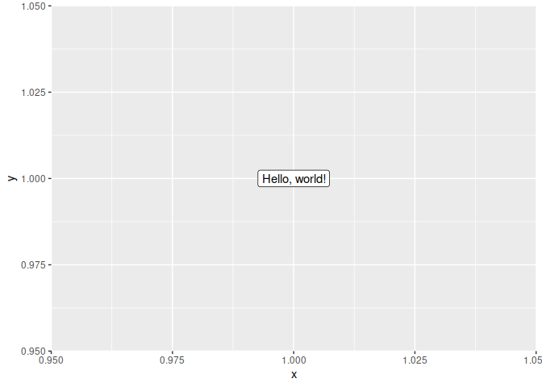

You can install the development version of advRpckg from GitHub with:

``` r
# install.packages("devtools")
devtools::install_github(repo = "strnda/advRpckg")
```

``` r
library(advRpckg)

hello()
#>           hello
#> 1 Hello, world!

plot(hello())
```



